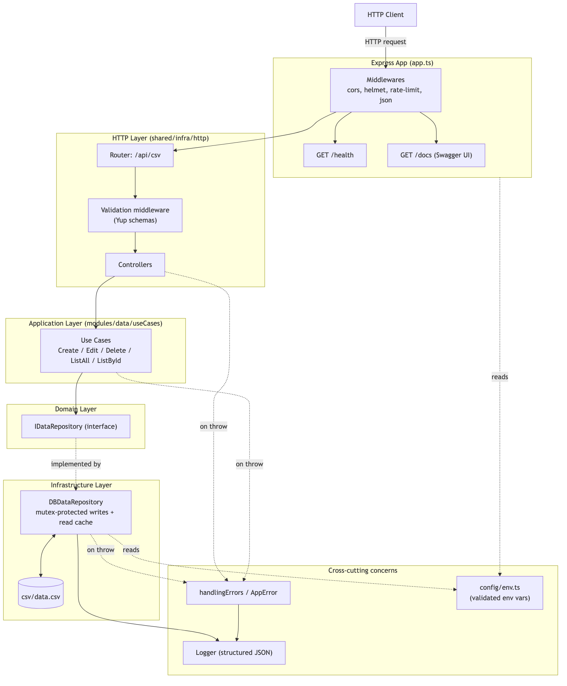
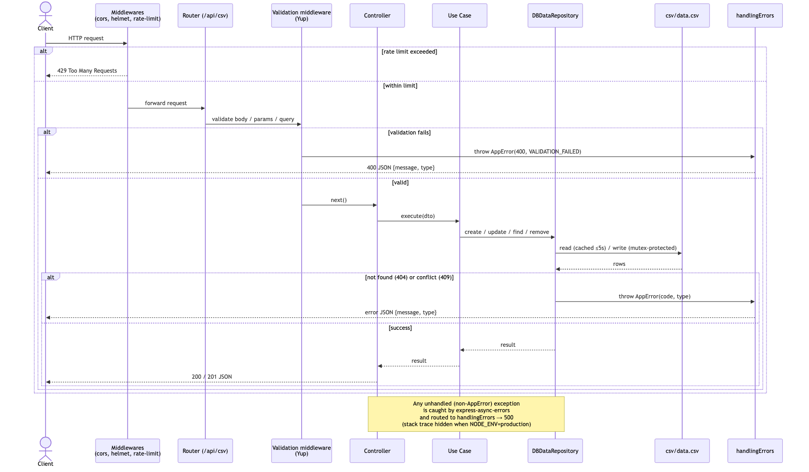
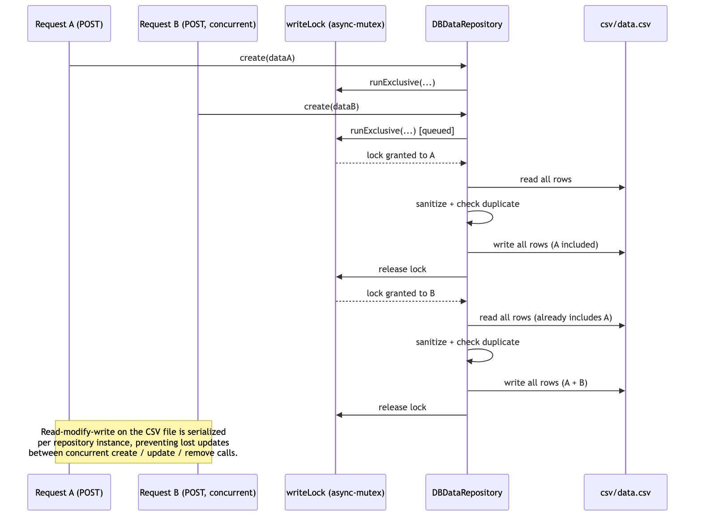
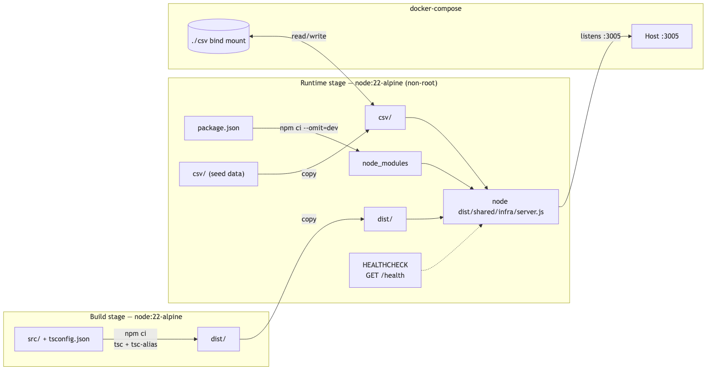

# System Flow

This document explains how a request moves through the system, how concurrent
writes to the CSV file are kept safe, and how the application is built and
deployed. Diagrams are generated from Mermaid sources — see
[Regenerating the diagrams](#regenerating-the-diagrams).

## 1. Architecture

The project follows Clean Architecture: HTTP concerns, business rules and
data access are separated into distinct layers that only depend inward
(controllers depend on use cases, use cases depend on a repository
_interface_, never on the concrete CSV implementation).



- **Express App** (`src/shared/infra/app.ts`) wires global middlewares
  (`cors`, `helmet`, rate limiting, JSON body parsing), the `/health` check,
  the Swagger UI at `/docs`, and mounts the `/api/csv` router.
- **HTTP layer** (`src/shared/infra/http`) validates input with Yup schemas
  before it ever reaches a controller, and dispatches to controllers.
- **Application layer** (`src/modules/data/useCases`) holds one use case per
  operation (create, edit, delete, list all, list by id) — plain business
  logic with no knowledge of Express or CSV.
- **Domain layer**: `IDataRepository` is the interface use cases depend on,
  which keeps them testable with an in-memory fake (see
  `src/tests/InMemoryDataRepository.ts`).
- **Infrastructure layer**: `DBDataRepository` implements that interface on
  top of `csv/data.csv`, with a short-lived read cache and mutex-protected
  writes (see [§3](#3-concurrency-safe-writes)).
- **Cross-cutting**: `AppError` + `handlingErrors` centralize error
  responses, `logger` emits structured JSON logs, and `config/env.ts`
  validates every environment variable once at startup.

## 2. Request lifecycle

A single request — happy path and the error paths it can take at each
step:



Key points:

- Requests are rate-limited before they reach any route (`/api/*`, 100
  requests per minute by default).
- Validation runs _before_ the controller — a request with an invalid body,
  path parameter or query string never reaches business logic.
- Any error thrown anywhere in the chain (validation, use case, repository)
  ends up in the same place: `handlingErrors`. `AppError` instances map to
  their declared status code; anything else becomes a `500` with the stack
  trace hidden when `NODE_ENV=production`.

## 3. Concurrency-safe writes

`csv/data.csv` is a single flat file: every write is a full read-modify-write
of the whole file. Without coordination, two concurrent requests could read
the same snapshot and one write could silently overwrite the other
(a lost update). `DBDataRepository` serializes writes per instance with an
`async-mutex` lock:



The repository itself is a singleton (`export const dbDataRepository = new
DBDataRepository()`), shared by every controller — the lock only works
because every request goes through the same instance.

## 4. Build & deployment

The Docker image is a multi-stage build: TypeScript is compiled in a
throwaway build stage, and only the compiled output plus production
dependencies land in the final runtime image, which runs as a non-root user.



`docker-compose.yml` binds `./csv` into the container so the data survives
container restarts, and the built-in `HEALTHCHECK` polls `GET /health`.

## Regenerating the diagrams

Diagram **sources** (`docs/mmd/*.mmd`) and **rendered images**
(`docs/img/*.png`) are kept separate on purpose — the `.mmd` files are the
thing to edit; the `.png` files are a build artifact. After changing a
`.mmd` file, regenerate the images with:

```bash
./scripts/generate-diagrams.sh
```

This renders every `docs/mmd/*.mmd` file to `docs/img/*.png` via
[`@mermaid-js/mermaid-cli`](https://github.com/mermaid-js/mermaid-cli)
(fetched on demand through `npx`, not installed as a project dependency).
